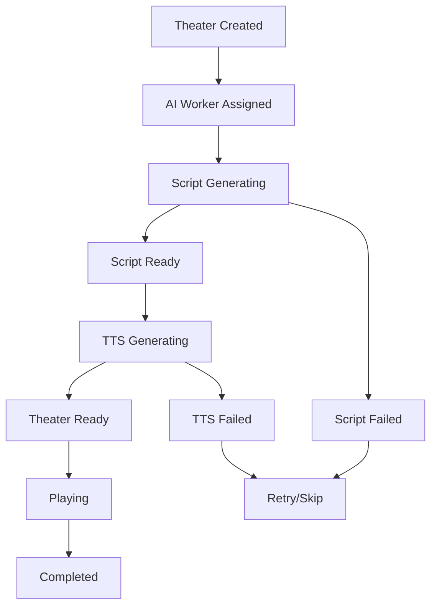

# 架构设计：并发新闻处理与排队播放流水线

## 1. 背景：从"单任务"到"多任务"的演进

在最初的架构中，我们为每个角色（Tom、Mark、Host）分别调用AI API，这种方式虽然能模拟真实的对话互动，但存在以下问题：

- **生成延迟累积**: 三次顺序调用导致总延迟过长
- **一致性难以保证**: 各AI独立生成可能导致话题偏离
- **资源利用率低**: AI调用串行化，无法充分利用并发能力

**改进方案**: 采用"统一剧本生成"模式，每条新闻由单个AI一次性生成完整的辩论脚本，然后启动并发的TTS配音流程。

## 2. 核心设计原则

### 2.1 剧场队列模型 (Theater Queue Model)

系统将新闻处理流程抽象为"剧场"概念，每条新闻对应一个剧场，包含完整的从剧本生成到配音完成的生命周期：

1. **流水线调度器 (Pipeline Orchestrator)**: 
    - 接收10条新闻主题，创建有序剧场队列
    - 管理AI工作池的任务分配
    - 维护播放指针和剧场状态

2. **剧场队列 (Theater Queue)**: 流水线的核心数据结构，每个剧场包含：
    ```typescript
    interface NewsTheater {
      id: string
      newsIndex: number          // 新闻排序索引（严格按序播放）
      newsTopic: string         // 新闻主题
      status: 'PENDING_SCRIPT' | 'GENERATING_SCRIPT' | 'PENDING_AUDIO' 
            | 'GENERATING_AUDIO' | 'READY_TO_PLAY' | 'PLAYING' | 'COMPLETED'
      script: DebateScript | null     // 完整剧本（包含所有角色对话）
      audioSequence: AudioClip[] | null // 有序音频片段
      assignedAI: 'Gemini' | 'Mistral' | 'Reka' | null
    }
    ```

3. **AI工作池 (AI Worker Pool)**: 
    - **并发策略**: 同时为前3条新闻生成剧本
    - **动态分配**: 任一AI完成后立即分配下一个待处理新闻
    - **输出格式**: 结构化剧本，包含角色对话的严格顺序

4. **TTS配音服务 (TTS Dubbing Service)**:
    - **触发条件**: 任一剧本生成完毕后立即启动
    - **并发配音**: 为剧本中的每个角色台词同时生成音频
    - **音频绑定**: 台词文本与音频文件严格一一对应

5. **双向触发播放器 (Bidirectional Player)**:
    - **顺序保证**: 严格按新闻索引顺序播放
    - **双向检查**: 播放完成时触发下一剧场，剧场就绪时检查播放条件

### 2.2 装配线类比

- **原料入口 (新闻列表)**: 一次性将 10 条新闻标题（原料）投入料仓。
- **中央调度员 (Orchestrator)**: 看到料仓里有原料，立即在"任务板"（任务队列）上创建 10 个有序任务卡。
- **三位作家 (AI Worker Pool)**: 调度员将任务卡 1, 2, 3 分别交给 Gemini, Mistral, Reka。三位作家同时开始创作脚本。
- **配音团队 (TTS Service)**: 假设 Gemini 最先完成脚本，调度员立刻将这份稿件交给配音团队。配音团队开始为稿件中的台词安排不同音色的角色配音。
- **作家轮换**: 与此同时，由于 Gemini 空闲了下来，调度员马上将任务卡 4 交给他，让他继续工作，绝不闲置。
- **成品仓库 (Queue's READY_TO_PLAY section)**: 配音团队完成一份完整辩论的全部音频后，将这个"音频合集"打包，贴上"可播放"标签，放到成品仓库的货架上。
- **顾客 (Frontend Player)**: 顾客来到仓库，**按照顺序收取成品（由于文字生成与语言生成都是并行的，所以不可避免会出现比如第六条新闻早于第五条新闻完成文字和配音，这个时候虽然它们处于准备好的状态，依然不能先于第五条播放，直到它的前一条播放完，且自己也已经准备好，才开始播放）**。收听完毕后，再回来取下一个。理想情况下，由于生产速度远快于收听速度，货架上总是有成品等待被取用。

## 3. 可配置性与动态参数

为了提升系统的灵活性和用户交互性，流水线支持在启动时传入动态参数：

### 3.1 动态辩论轮次
- **功能**: 用户可指定每场辩论的交锋轮次（2轮、3轮或更多）
- **实现**: `POST /api/pipeline/start` 接口接收 `debateRounds` 参数，用于动态构建AI提示词

### 3.2 动态音色选择  
- **功能**: 为每个角色选择不同的预设音色
- **实现**: `GET /api/voices` 返回可用音色列表，`voiceConfig` 对象映射角色与音色

## 4. 技术实现详细规范

### 4.1 核心接口定义

```typescript
interface NewsTheater {
  theaterId: number;
  status: 'generating' | 'ready' | 'playing' | 'completed' | 'failed';
  
  // AI 生成状态
  aiProvider: 'gemini' | 'mistral' | 'reka';
  scriptContent?: string;
  
  // TTS 生成状态
  ttsProgress: Array<{
    role: 'tom' | 'mark' | 'host';
    text: string;
    audioUrl?: string;
    status: 'pending' | 'generating' | 'completed' | 'failed';
  }>;
  
  // 播放状态
  playbackStartTime?: Date;
  estimatedDuration?: number; // 毫秒
  actualEndTime?: Date;
  
  // 双向触发机制
  canTriggerNext: boolean; // 是否可以触发下一个剧院
  canTriggerPrevious: boolean; // 是否可以被前一个剧院触发
}

class PipelineOrchestrator {
  private theaters: Map<number, NewsTheater> = new Map();
  private aiWorkerPool: AIWorkerPool;
  private ttsService: IndexTTSService;
  
  async startPipeline(config: PipelineConfig): Promise<void>;
  async checkBidirectionalTriggers(): Promise<void>;
  async assignAIWorker(theaterId: number): Promise<void>;
  async generateTTSForTheater(theaterId: number): Promise<void>;
}
```

### 4.2 流水线状态转换



### 4.3 双向触发检查逻辑

```typescript
async checkBidirectionalTriggers(): Promise<void> {
  for (const [id, theater] of this.theaters) {
    if (theater.status === 'ready' && theater.canTriggerNext) {
      const nextTheater = this.theaters.get(id + 1);
      if (nextTheater?.canTriggerPrevious) {
        await this.startPlayback(id);
        break; // 每次只启动一个，保持严格顺序
      }
    }
  }
}
```

## 5. API 端点设计

### 5.1 流水线控制

```typescript
// 启动流水线
POST /api/pipeline/start
{
  "newsTopics": string[],
  "debateRounds": number,
  "voiceConfig": {
    "tom": "energetic-male",
    "mark": "calm-female", 
    "host": "professional-neutral"
  }
}

// 获取流水线状态
GET /api/pipeline/status
Response: {
  "theaters": NewsTheater[],
  "overallProgress": number,
  "currentPlaying": number | null
}

// 手动触发下一个剧院
POST /api/pipeline/next
{
  "theaterId": number
}
```

### 5.2 音频资源管理

```typescript
// 获取可用音色列表
GET /api/voices
Response: {
  "voices": Array<{
    "id": string,
    "name": string,
    "description": string,
    "previewUrl": string
  }>
}

// 获取剧院音频URL
GET /api/theater/{theaterId}/audio
Response: {
  "audioSequence": Array<{
    "role": string,
    "text": string,
    "audioUrl": string,
    "duration": number
  }>
}
```

## 6. 前端状态管理

### 6.1 状态结构

```typescript
interface PipelineState {
  theaters: Map<number, NewsTheater>;
  currentPlayingId: number | null;
  overallProgress: number;
  isPlaying: boolean;
  audioPlayer: HTMLAudioElement | null;
}

// Zustand Store
const usePipelineStore = create<PipelineState>((set, get) => ({
  theaters: new Map(),
  currentPlayingId: null,
  overallProgress: 0,
  isPlaying: false,
  audioPlayer: null,
  
  startPipeline: async (config) => {
    // 调用 API 启动流水线
    const response = await fetch('/api/pipeline/start', {
      method: 'POST',
      body: JSON.stringify(config)
    });
  },
  
  playNext: async () => {
    // 触发下一个剧院播放
    const { currentPlayingId } = get();
    if (currentPlayingId !== null) {
      await fetch(`/api/pipeline/next`, {
        method: 'POST',
        body: JSON.stringify({ theaterId: currentPlayingId + 1 })
      });
    }
  }
}));
```

### 6.2 实时状态同步

```typescript
// WebSocket连接用于实时状态更新
const useWebSocketSync = () => {
  const updateTheaterStatus = usePipelineStore(state => state.updateTheaterStatus);
  
  useEffect(() => {
    const ws = new WebSocket('/api/pipeline/ws');
    
    ws.onmessage = (event) => {
      const update = JSON.parse(event.data);
      updateTheaterStatus(update.theaterId, update.status);
    };
    
    return () => ws.close();
  }, []);
};
```

## 7. 性能优化策略

### 7.1 资源预加载
- **音频预缓存**: 剧院状态变为 `ready` 时预加载所有音频文件
- **渐进式加载**: 优先加载前3个剧院的资源

### 7.2 内存管理
- **音频清理**: 播放完成后释放音频资源
- **状态清理**: 定期清理已完成剧院的详细状态信息

### 7.3 错误恢复
- **AI调用重试**: 单个AI失败时自动重试或转移至其他AI
- **TTS降级**: IndexTTS失败时回退到本地TTS或跳过音频

## 8. 监控与调试

### 8.1 流水线监控面板

```typescript
// 调试专用的监控组件
const PipelineMonitor = () => {
  return (
    <div className="grid grid-cols-5 gap-2">
      {theaters.map(theater => (
        <TheaterCard 
          key={theater.id}
          theater={theater}
          onForceNext={() => triggerNext(theater.id)}
          onRetryGeneration={() => retryGeneration(theater.id)}
        />
      ))}
    </div>
  );
};
```

### 8.2 性能指标

- **生成延迟**: AI脚本生成时间统计
- **TTS延迟**: 音频生成时间统计  
- **播放连续性**: 剧院间切换的无缝度测量
- **资源利用率**: AI工作池的并发效率

---

此架构文档为AI新闻辩论系统的并发流水线提供了完整的技术规范。通过剧院队列、AI工作池和双向触发机制，系统能够实现高效的并发处理和无缝的用户体验。
