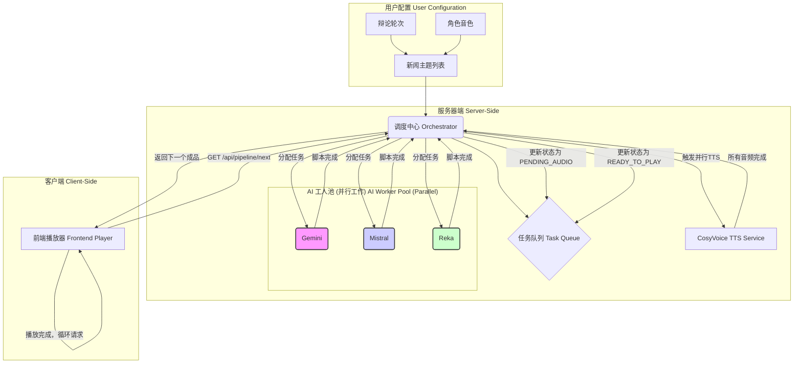

# 架构设计：并发新闻处理与排队播放流水线

## 1. 背景：从“单任务”到“多任务”的演进

在先前的架构中，系统遵循“一次请求，一次处理”的单任务模式。用户提供一个新闻主题，系统完成“文本生成 -> 语音合成 -> 播放”的完整流程后才能开始下一个任务。这种模式的瓶颈在于：

1.  **资源闲置**: 系统拥有三个强大的 AI Provider (Gemini, Mistral, Reka)，但在单任务模式下，任意时刻只有一个在工作，造成了严重的计算资源浪费。
2.  **用户等待**: 用户必须等待一个新闻周期完全结束后才能收听下一个，无法实现连续、无中断的“新闻流”体验。
3.  **吞吐量低**: 系统的整体新闻处理能力受限于最慢的串行步骤，无法高效地处理批量新闻。

## 2. 解决方案：并发处理与排队播放的“智能装配线”

为了解决以上问题，我们将系统升级为一种宏观的、并行的“智能装配线”模型。该模型将多个新闻条目的处理流程解耦，通过一个中央任务队列和并发的工作池，实现了高效、流式的自动化处理。

### 2.1 核心组件

1.  **调度中心 (The Orchestrator)**: 整个流水线的“大脑”，一个常驻后端的服务。它负责从新闻源接收任务、初始化任务队列、向下游的“工人”分配任务，并根据任务完成情况更新队列状态。

2.  **任务队列 (The Task Queue)**: 流水线的“传送带”。这是一个服务器端的共享队列，每一项代表一个新闻辩论任务，并包含其生命周期状态，如：`PENDING_TEXT` (待处理), `GENERATING_TEXT` (文本生成中), `PENDING_AUDIO` (待语音化), `GENERATING_AUDIO` (语音生成中), `READY_TO_PLAY` (成品), `DONE` (已消费)。

3.  **AI 工人池 (The AI Worker Pool)**: 系统的核心生产力。我们将 `Gemini`, `Mistral`, `Reka` 三个 AI Provider 视为一个并行的工人池。调度中心可以同时给它们分配不同的新闻任务，实现文本脚本的并行生成。

4.  **TTS 服务 (The TTS Service)**: 流水线的第二道工序。一旦任何一个 AI 工人完成了文本脚本，调度中心会立刻将该脚本分发给 TTS 服务，进行并行的语音合成（即三种音色的播音员同时生产声音，但也是与相应的剧本对应并排序的，也就是说，在同一段新闻剧本中，三个配音员在n交流中按照顺序发言，主持人只有在开始和最后才发言，当然，在同一段新闻中，要等配音全部完成后才按照顺序播放，所以谁先生成谁后生成关系不大，复杂度较低）。

5.  **前端播放器 (The Consumer)**: 流水线的最终“消费者”。它与调度中心通信，从任务队列的头部取用状态为 `READY_TO_PLAY` 的成品进行播放，并在播放结束后自动请求下一个，实现连续播放。

### 2.2 装配线类比

-   **原料入口 (新闻列表)**: 一次性将 10 条新闻标题（原料）投入料仓。
-   **中央调度员 (Orchestrator)**: 看到料仓里有原料，立即在“任务板”（任务队列）上创建 10 个有序任务卡。
-   **三位作家 (AI Worker Pool)**: 调度员将任务卡 1, 2, 3 分别交给 Gemini, Mistral, Reka。三位作家同时开始创作脚本。
-   **配音团队 (TTS Service)**: 假设 Gemini 最先完成脚本，调度员立刻将这份稿件交给配音团队。配音团队开始为稿件中的台词安排不同音色的角色配音。
-   **作家轮换**: 与此同时，由于 Gemini 空闲了下来，调度员马上将任务卡 4 交给他，让他继续工作，绝不闲置。
-   **成品仓库 (Queue's READY_TO_PLAY section)**: 配音团队完成一份完整辩论的全部音频后，将这个“音频合集”打包，贴上“可播放”标签，放到成品仓库的货架上。
-   **顾客 (Frontend Player)**: 顾客来到仓库，**按照顺序收取成品（由于文字生成与语言生成都是并行的，所以不可避免会出现比如第六条新闻早于第五条新闻完成文字和配音，这个时候虽然它们处于准备好的状态，依然不能先于第五条播放，直到它的前一条播放完，且自己也已经准备好，才开始播放）**。收听完毕后，再回来取下一个。理想情况下，由于生产速度远快于收听速度，货架上总是有成品等待被取用。

## 3. 可配置性与动态参数

为了提升系统的灵活性和用户交互性，流水线的设计支持在启动时传入动态参数，允许用户自定义辩论的细节。

### 3.1 动态辩论轮次

-   **功能**: 用户可以指定每场辩论的交锋轮次（例如，2轮、3轮或更多）。
-   **实现**: `POST /api/pipeline/start` 接口将接收一个 `debateRounds` 参数。这个参数将被调度中心用于动态构建发送给 AI Provider 的提示词（Prompt），例如：`"...Tom and Mark should exchange opinions for ${debateRounds} rounds..."`。

### 3.2 动态音色选择

-   **功能**: 用户可以为 `moderator`, `tom`, `mark` 等每一个角色从一组预设的音色中选择一个。
-   **实现**: 这是一个两步机制：
    1.  **提供选项**: 新增一个 `GET /api/voices` 接口。该接口会返回一个可用的音色列表（例如，`[{ name: 'Energetic Male', voiceId: 'cosy-en-male-energetic' }, ...]`），供前端UI构建选择器。
    2.  **应用选择**: `POST /api/pipeline/start` 接口将接收一个 `voiceConfig` 对象，该对象映射了每个角色所选的音色配置。调度中心会将这个 `voiceConfig` 与任务绑定，在 TTS 生成阶段，据此为每个角色的台词应用正确的音色和风格。

## 4. 架构流程图



---

## 5. 实施要点

-   **核心数据结构 (任务队列项)**: 队列中的每一项至少应包含：
    ```typescript
    interface PipelineTask {
      id: string;
      newsTopic: string;
      status: 'PENDING_TEXT' | 'GENERATING_TEXT' | 'PENDING_AUDIO' | 'GENERATING_AUDIO' | 'READY_TO_PLAY' | 'DONE';
      script: object | null;
      audioPlaylist: string[] | null;
      voiceConfig: object; // 存储本次任务运行所使用的声音配置
      assignedWorker: 'Gemini' | 'Mistral' | 'Reka' | null;
    }
    ```

-   **后端 API 设计**: 需要一组新的 API 来驱动流水线。
    -   `POST /api/pipeline/start`: 接收新闻列表，以及可选的 `debateRounds` 和 `voiceConfig` 参数，初始化队列并启动调度器。
    -   `GET /api/voices`: 新增端点，返回一个预定义的、可供用户选择的音色列表。
    -   `GET /api/pipeline/status`: (可选) 返回整个队列的当前状态，用于调试或前端展示。
    -   `GET /api/pipeline/next`: 核心端点，供播放器获取**严格按顺序**的下一个成品。它会检查内部“播放指针”指向的任务，只有当该特定任务就绪时才返回数据，否则返回“等待”状态。

-   **状态管理**: 后端需要一个单例（Singleton）或类似的机制来维护全局唯一的任务队列和调度器实例。
    -   除了任务队列，单例中还需维护一个 `currentPlayIndex` 变量（播放指针），用于追踪下一个待播放任务的索引，确保播放顺序。

-   **异步流程控制**: 调度器是整个系统的核心。它需要管理一个 AI Provider 的“工作状态池”，并使用 `Promise.all` 或类似的并发控制手段来高效地执行文本和语音的生成任务。

-   **前端播放逻辑**: 前端播放器负责消费。其核心逻辑是一个循环：`请求下一个成品 -> 收到数据后播放 -> 播放完毕 -> 再次请求下一个`。如果API返回“等待”状态，播放器将暂停并**在短暂延迟后轮询**，直到获取到数据为止。

-   **AI Provider 适配**: 必须确保所有三个 AI Provider 的提示词都能被动态构建，以支持可变的 `debateRounds`。同时，输出的 JSON 格式必须保持稳定。